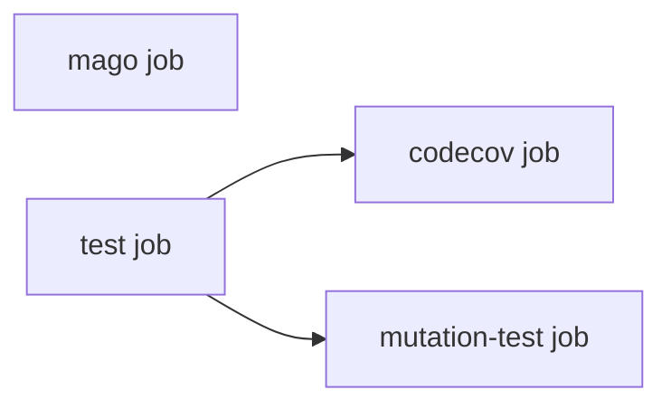

# Workflow architecture (planned)

This document describes the planned job-split design for
[`continuous-integration.yml`](../.github/workflows/continuous-integration.yml)
to support driver packages that need a seeded RDBMS for integration testing,
plus optional Codecov and Infection mutation testing. **Not yet implemented**
— the current workflow only runs the `qa` job (Mago + PHPUnit). This is a
reference for the follow-up PR that implements it.

## Job graph

Only genuine data/gating dependencies are expressed via `needs:`; everything
else runs in parallel for speed.



- `mago` and `test` have **no `needs:`** between them — they're independent
  gates, neither consumes the other's output.
- `codecov` and `mutation-test` both **`needs: [test]`** — real dependencies
  (artifact consumption / gating), not just ordering preference.

## `mago` job

Matrix: `php-versions` only. Runs `mago format --check`, `mago lint`,
`mago analyze`, `mago guard`. No DB, no dependency-strategy matrix — the
committed `composer.lock` is enough for type resolution.

## `test` job

Matrix: `php x [lowest, locked, latest]`.

### DB service (manual step, not native `services:`)

GitHub Actions job-level `services:` blocks can't be conditionally omitted
per input (no `if:` support there), and different driver packages need
different engines (MySQL now, Postgres/SQLite later). Instead, DB startup is
a manual step gated on a generic `db-image` input:

```yaml
- name: Start DB service
  if: inputs.db-image != ''
  run: |
    docker run -d --name db \
      -p ${{ inputs.db-port }}:${{ inputs.db-port }} \
      $(echo '${{ inputs.db-env-json }}' | jq -r 'to_entries[] | "-e \(.key)=\(.value)"' | tr '\n' ' ') \
      ${{ inputs.db-image }}

- name: Wait for DB to be healthy
  if: inputs.db-image != ''
  run: |
    for i in $(seq 1 30); do
      docker exec db ${{ inputs.db-health-cmd }} && exit 0
      sleep 2
    done
    echo "DB did not become healthy in time" && exit 1
```

`jq` unpacks the `db-env-json` map into `-e KEY=VALUE` flags since `docker
run` doesn't accept JSON directly. The health check polls via `docker exec`
in a retry loop rather than Docker's native `HEALTHCHECK`, so it works the
same regardless of image. No explicit teardown is needed — GitHub-hosted
runners are ephemeral.

Repos with no DB simply omit `db-image` (default `""`); both steps are
skipped, zero cost.

### Coverage

Unit tests always run; integration tests run `if: inputs.run-integration`.
On exactly one canonical leg (`matrix.php == inputs.coverage-php-version &&
matrix.dependencies == 'locked'`), coverage is collected (pcov → `clover.xml`)
and uploaded via `actions/upload-artifact` — the only leg downstream jobs
need.

## `codecov` job

`needs: [test]`, job-level `if: inputs.enable-codecov`. Downloads the
`clover.xml` artifact and runs `codecov/codecov-action`. No PHP setup, no DB.

`CODECOV_TOKEN` is an org-wide upload token (php-db org), so it can't infer
the target repo on its own — pass `slug: ${{ github.repository }}`. Inside a
*reusable* workflow, `github.repository` already resolves to the **calling**
repo, so this works with no extra input.

## `mutation-test` job

`needs: [test]` (gating — skip if base tests already failed). Job-level
`if: inputs.enable-infection`. Needs its own full environment (checkout,
setup-php **with `tools: mago`**, `composer install --locked`, the same
conditional DB-startup step as `test` if `run-integration`) since Infection
re-executes the suite per mutant — it can't just consume `test`'s artifact
the way `codecov` does.

**No `needs: [mago]`.** `infection.json5`'s `staticAnalysisTool: "mago"`
makes Infection invoke `mago analyze` internally against mutants that escape
the test suite — that's a tooling requirement inside this job (the `mago`
binary + the repo's own `mago.toml`), not a cross-job dependency on the
`mago` job.

`INFECTION_DASHBOARD_API_KEY` is a per-repo secret (one per driver package,
generated by registering the repo at dashboard.stryker-mutator.io). Either
`INFECTION_DASHBOARD_API_KEY` or `STRYKER_DASHBOARD_API_KEY` works as the env
var name. **Must be passed as an `env:` block on the `run:` step, not as a
`with:` input** — Infection reads it from the environment, not a CLI flag.

## Secrets

Because `CODECOV_TOKEN` is org-scoped and `INFECTION_DASHBOARD_API_KEY` is
repo-scoped, each consuming repo's caller workflow should invoke this
reusable workflow with `secrets: inherit` rather than an explicit per-secret
mapping — it transparently pulls from whichever scope actually defines each
secret. Cross-repo `secrets: inherit` works for reusable workflows called
within the same GitHub org.

## New inputs (not yet added)

| Input | Purpose |
|---|---|
| `db-image` | Container image for the DB service (e.g. `mysql:8.0`). Empty = no DB. |
| `db-env-json` | JSON object of container env vars. |
| `db-port` | Port to expose/map. |
| `db-health-cmd` | Command run via `docker exec` to check readiness. |
| `enable-codecov` | Turns on the `codecov` job. |
| `enable-infection` | Turns on the `mutation-test` job. |
| `coverage-php-version` | Which matrix leg is canonical for coverage/mutation. |

Plus `secrets: CODECOV_TOKEN`, `INFECTION_DASHBOARD_API_KEY` on
`workflow_call` (both `required: false`).

## Reference example

Once implemented, phpdb-mysql's caller workflow
(`.github/workflows/continuous-integration.yml`) is the reference example
for wiring up a DB-backed driver package — every input set with a brief
comment explaining what it controls, so other driver packages (Postgres,
SQLite, etc.) can copy/adapt it directly.
