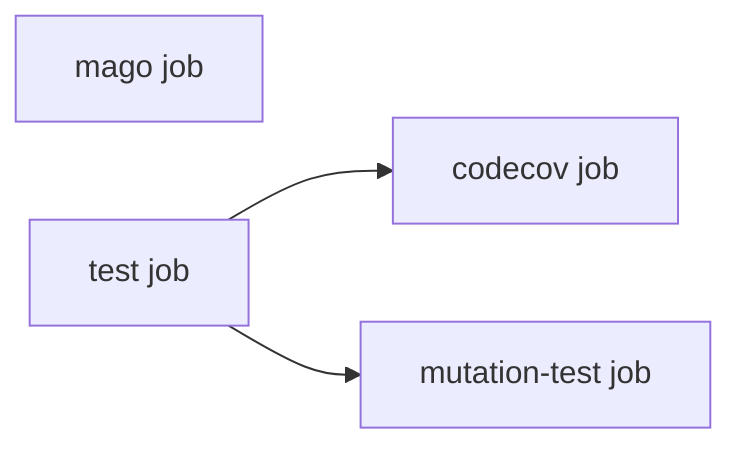

# Workflow architecture

This document describes the job-split design implemented in
[`continuous-integration.yml`](../.github/workflows/continuous-integration.yml)
to support driver packages that need a seeded RDBMS for integration testing,
plus optional Codecov and Infection mutation testing.

## Job graph

Only genuine data/gating dependencies are expressed via `needs:`; everything
else runs in parallel for speed.



- `mago` and `test` have **no `needs:`** between them — they're independent
  gates, neither consumes the other's output.
- `codecov` and `mutation-test` both **`needs: [test]`** — real dependencies
  (artifact consumption / gating), not just ordering preference.

## `mago` job

Matrix: `php-versions` only. Runs `mago format --check`, `mago lint`,
`mago analyze`, `mago guard`. No DB, no dependency-strategy matrix — the
committed `composer.lock` is enough for type resolution.

## `test` job

Matrix: `php x [lowest, locked, latest]`.

### DB service (manual step, not native `services:`)

Native job-level `services:` blocks *can* be conditionally disabled (an
empty `image:` expression means the service won't start — see
[GitHub's docs](https://docs.github.com/en/actions/reference/workflows-and-actions/workflow-syntax#jobsjob_idservicesservice_idimage)),
so conditionality alone isn't why this uses a manual step. The real
constraint: `services.<id>.env` is a **static YAML map** — its *keys* must
be fixed at authoring time, and expressions can only substitute values, not
key names. Different engines need different env var names entirely
(MySQL's `MYSQL_ROOT_HOST`/`MYSQL_DATABASE`, Postgres's
`POSTGRES_PASSWORD`/`POSTGRES_DB`, ...), so a single generic `db-env-json`
input (arbitrary keys, unknown to the workflow until runtime) can't be
expressed through native `services:` at all — only a step that parses JSON
at runtime (the `jq` unpacking below) can.

**This is deliberately engine-agnostic** — the workflow never hardcodes
MySQL (or any other engine). `php-db/phpdb` (the base abstraction package,
no RDBMS at all) simply never sets `db-image` and pays zero cost. Every
driver package (MySQL, Postgres, MariaDB, Oracle, MSSQL, ...) supplies its
own image/env/port/health-command; SQLite drivers need no service at all
(embedded, no server) and also just omit `db-image`. The shared workflow
never needs to enumerate or special-case any specific engine.

```yaml
- name: Start DB service
  if: inputs.db-image != ''
  run: |
    docker run -d --name db \
      -p ${{ inputs.db-port }}:${{ inputs.db-port }} \
      $(echo '${{ inputs.db-env-json }}' | jq -r 'to_entries[] | "-e \(.key)=\(.value)"' | tr '\n' ' ') \
      ${{ inputs.db-image }}

- name: Wait for DB to be healthy
  if: inputs.db-image != ''
  run: |
    for i in $(seq 1 ${{ inputs.db-health-retries }}); do
      docker exec db ${{ inputs.db-health-cmd }} && exit 0
      sleep ${{ inputs.db-health-interval-seconds }}
    done
    echo "DB did not become healthy in time" && exit 1
```

`jq` unpacks the `db-env-json` map into `-e KEY=VALUE` flags since `docker
run` doesn't accept JSON directly. The health check polls via `docker exec`
in a retry loop rather than Docker's native `HEALTHCHECK`, so it works the
same regardless of image. No explicit teardown is needed — GitHub-hosted
runners are ephemeral.

`db-health-retries` / `db-health-interval-seconds` default to `30` / `2`
(60s total — plenty for MySQL/Postgres/MariaDB) but are overridable per
caller, since Oracle/MSSQL images can take several minutes to become ready.

Repos with no DB simply omit `db-image` (default `""`); both steps are
skipped, zero cost.

### Coverage

Unit tests always run; integration tests run `if: inputs.run-integration`.
On exactly one canonical leg (`matrix.php == inputs.coverage-php-version &&
matrix.dependencies == 'locked'`), coverage is collected (pcov → `clover.xml`)
and uploaded via `actions/upload-artifact` — the only leg downstream jobs
need.

## `codecov` job

`needs: [test]`, job-level `if: inputs.enable-codecov`. Downloads the
`clover.xml` artifact and runs `codecov/codecov-action`. No PHP setup, no DB.
`fail_ci_if_error: false` — report-only for all consuming repos while they're
still legacy codebases being migrated; upload/coverage issues don't fail CI.

`CODECOV_TOKEN` is an org-wide upload token (php-db org), so it can't infer
the target repo on its own — pass `slug: ${{ github.repository }}`. Inside a
*reusable* workflow, `github.repository` already resolves to the **calling**
repo, so this works with no extra input.

## `mutation-test` job

`needs: [test]` (gating — skip if base tests already failed). Job-level
`if: inputs.enable-infection`. Needs its own full environment (checkout,
setup-php **with `tools: mago`**, `composer install --locked`, the same
conditional DB-startup step as `test` if `run-integration`) since Infection
re-executes the suite per mutant — it can't just consume `test`'s artifact
the way `codecov` does.

**No `needs: [mago]`.** `infection.json5`'s `staticAnalysisTool: "mago"`
makes Infection invoke `mago analyze` internally against mutants that escape
the test suite — that's a tooling requirement inside this job (the `mago`
binary + the repo's own `mago.toml`), not a cross-job dependency on the
`mago` job.

`INFECTION_DASHBOARD_API_KEY` is a per-repo secret (one per driver package,
generated by registering the repo at dashboard.stryker-mutator.io). Either
`INFECTION_DASHBOARD_API_KEY` or `STRYKER_DASHBOARD_API_KEY` works as the env
var name. **Must be passed as an `env:` block on the `run:` step, not as a
`with:` input** — Infection reads it from the environment, not a CLI flag.

## Secrets

Because `CODECOV_TOKEN` is org-scoped and `INFECTION_DASHBOARD_API_KEY` is
repo-scoped, each consuming repo's caller workflow should invoke this
reusable workflow with `secrets: inherit` rather than an explicit per-secret
mapping — it transparently pulls from whichever scope actually defines each
secret. Cross-repo `secrets: inherit` works for reusable workflows called
within the same GitHub org.

## Inputs

| Input | Purpose |
|---|---|
| `db-image` | Container image for the DB service (e.g. `mysql:8.0`). Empty = no DB. |
| `db-env-json` | JSON object of container env vars. |
| `db-port` | Port to expose/map. |
| `db-health-cmd` | Command run via `docker exec` to check readiness. |
| `db-health-retries` | Max health-check attempts (default `30`). Raise for slow-starting engines (Oracle, MSSQL). |
| `db-health-interval-seconds` | Seconds to sleep between health-check attempts (default `2`). |
| `enable-codecov` | Turns on the `codecov` job. |
| `enable-infection` | Turns on the `mutation-test` job. |
| `coverage-php-version` | Which matrix leg is canonical for coverage/mutation. |

Plus `secrets: CODECOV_TOKEN`, `INFECTION_DASHBOARD_API_KEY` on
`workflow_call` (both `required: false`).

## Reference example

phpdb-mysql's caller workflow (`.github/workflows/continuous-integration.yml`)
is the reference example for wiring up a DB-backed driver package — every
input set with a brief comment explaining what it controls, so other driver
packages (Postgres, SQLite, etc.) can copy/adapt it directly.
